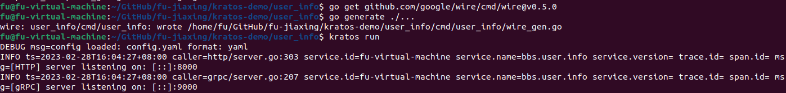

# Kratos demo 实战

## 简介

基于 kratos 将之前 demo 中的 grpc 服务 user_info 改造成微服务，其基本功能还是给外部提供 GetUserInfo 的接口，获取用户信息。在本次实验中，在 MySQL 外还引入了 Redis，体验了在 go 环境下的 Redis 客户端的使用。

基本功能：

本次实验定义了两个服务：

- user_info 作为服务端服务，对外提供 grpc 和 http 两种访问接口。本次实验内容主要针对该服务进行。
- user_client 是一个客户端服务，用来模拟对 user_info 发起 grpc 请求。

GetUserInfo 是定义在 proto 中的接口，它根据传入的 userID 返回用户信息，用户信息包含两部分：

- 用户基本信息，存储在 MySQL 中，user_info 服务会直接从 MySQL 读取。
- 用户的主页访问量，[假设]是一个高热数据，缓存在 Redis 上，user_info 服务会从 Redis 读取。

实验要求：

本次实验的目的是通过 demo 的开发来加深对 kratos 框架的理解，其实现内容包括：

1. 从零搭建项目结构，不使用 layout，加深使用 kratos 搭建项目框架的理解。
2. 引入 Consul 实现服务注册与发现
3. 在本地机器运行多个 user_info 实例，模拟负载均衡
4. 中间件实验：
    1. 引入 metrics，使用 grafana 搭建可视化大盘
    2. 在 user_info 模拟限流器
    3. 在 user_client 模拟熔断器


运行
```bash
# 前提：启动 consul, prometheus, redis, mysql
cd user_info
go mod tidy
kratos run

cd user_client
go mod tidy
go run ./cmd/main.go

```


## 从零开始搭建项目

虽然说是从零搭建，但项目结构还是参考了 layout

1. 编译pb文件

```bash
go mod init <project-name>

kratos proto add api/xxx/abc.proto
kratos proto client api/xxx/abc.proto # 生成客户端代码
kratos proto server api/xxx/abc.proto internal/service # 生成服务端代码
```

1. 注册 grpc / http：传入 network, addr, timeout 参数
   
    对应 internal/server，
    
    `var ProviderSet = wire.NewSet(NewGRPCServer, NewHTTPServer)`
    
2. 启动配置 main.go
   
    定义服务属性：Name, Verison, ID, Server, Logger …
    
    读取配置文件
    
3. 依赖注入 wire.go
   
    ```go
    // 需要在 package 前加上以下注释
    //go:build wireinject
    // +build wireinject
    
    func WireApp(*conf.Server, *conf.Data, log.Logger) (*kratos.App, func(), error) {
       panic(wire.Build(
    			server.ProviderSet, 
    			biz.ProviderSet, 
    			service.ProviderSet, 
    			newApp))
    }
    
    ```
    
4. 编译运行
   
    ```bash
    go mod tidy
    go generate ./...  # 生成 wire_gen.go
    kratos run 
    ```
    

运行结果



## 使用 Redis, MySQL 读写数据

在 /internal/data 编写代码，配置 db 和 redis 连接


编写业务逻辑代码


用户信息包含两部分数据，其一是用户的基本信息，从 MySQL 获取；其二是用户页面的访问量，作为高热数据存储在 Redis。数据从不同数据源读取后组装返回给调用者。

运行结果：


注意点：

1. 避免 circle import
2. 注意 wire 依赖注入的初始化顺序，否则可能：
    1. inject WireApp: no provider found for user_info/internal/biz.UserRepo
    2. inject WireApp: unused provider set "DataProviderSet”

## 服务注册与发现

使用 Consul 进行服务注册和发现

server 端 (user_info) 服务注册：


client 端服务发现：


客户端执行一个脚本，每隔1s进行一次 RPC 调用，执行结果：


Consul web 页面：


## 负载均衡实验

在不同的端口运行多个 user_info 实例，它们 Name 相同，使用访问地址区分 ID

Consul web 页面：


服务端的pb文件做些修改，返回实例的 IP 地址

客户端配置负载均衡 `selector.SetGlobalSelector(wrr.NewBuilder())`

运行结果：依赖 wrr 的负载均衡策略，客户端依次调用不同服务端实例的接口。


## Metrics 实验

实验内容：user_info 服务内利用 metrics 中间件记录请求指标，指标存储在 prometheus，通过 grafana 搭建大盘。使用 user_client 向 user_info 循环不断地发起请求，请求间隔随机。

实验定义了两个指标：

- duration_sec：使用 histogram 统计请求响应时间
- throughput：使用 counter 统计处理的请求数量

user_info 使用 prometheus 默认方式注册指标：


使用中间件来记录指标：


在 prmetheus 配置中添加新的 job，运行后界面如下：


通过 prometheus 中的指标数据，grafana 配置了两个图表：

- 其一是根据 duration_sec 指标配置请求响应时间直方图：
  
    `ceil(increase(bbs_user_info_server_requests_duration_sec_bucket{le!="+Inf"}[1m]))`
    
- 其二是根据 throughput 指标配置了请求QPS曲线图。
  
    `sum(rate(bbs_user_info_server_requests_throughput[1m])) by (operation)`
    

结果如下


## 限流器实验

使用 time/rate 实现了一个令牌桶限流器，需要实现 ratelimit.Limiter 接口


通过中间件来加入限流器，设置每0.5ms放一个令牌


使用 user_client 来轮询调用 user_info.GetUserInfo 的接口，被限流的请求会返回

 {code=429, reason=”RATELIMIT“} 的错误

grafana 监控结果如下：


## 熔断器实验

在 user_client 配置默认的熔断器中间件`circuitbreaker.Client()`

因为该熔断器只会针对服务端返回的特定几个 error 熔断：


所以在服务端加了一个自定义中间件，对请求随机返回错误码为 500 的响应错误。


执行 user_client，grafana 监控如图：


user_client 收到 user_info 返回的 500 错误后，触发熔断，之后的请求在客户端就输出 {code = 503 reason = CIRCUITBREAKER } 错误，不再发送到服务端。